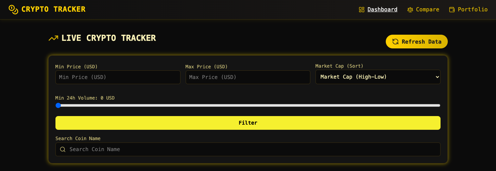
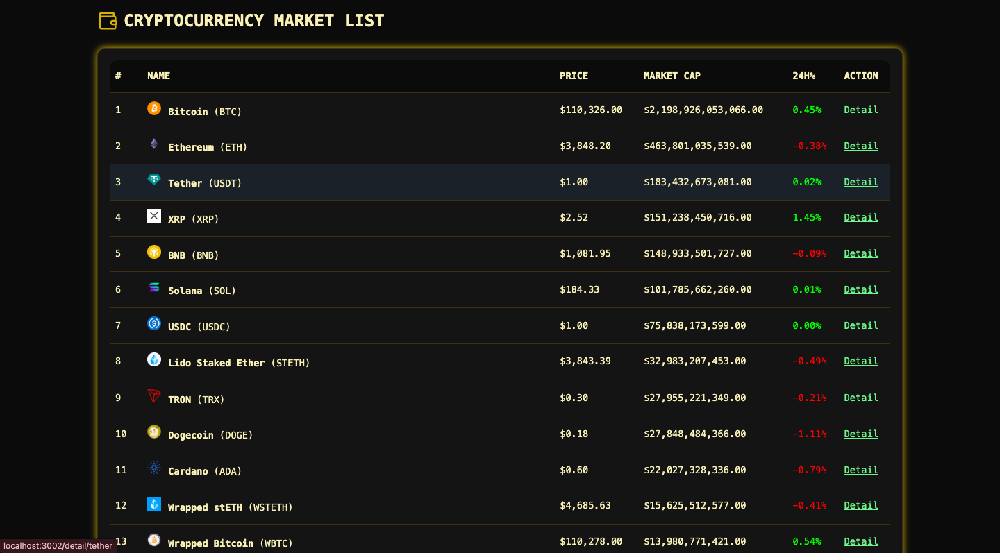
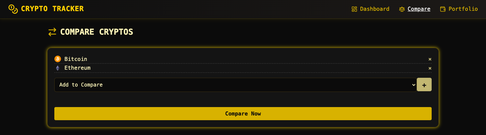
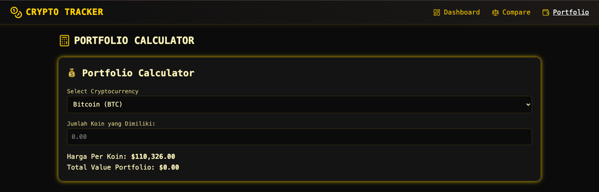
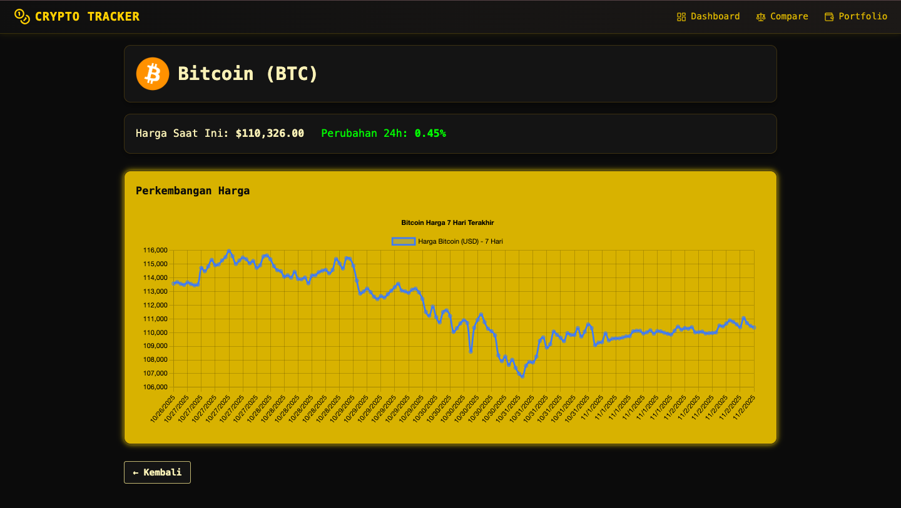

HEAD
# UTS-PEMWEB-123140172-RB

Nama : Atika Adelia <br />
NIM : 123140172 <br /> 

Dosen Pengampu : Muhammad Habib Algifari, S.Kom., M.TI. <br />
Mata Kuliah : Pemrograman Aplikasi dan Web RB <br />

# 🪙 Crypto Tracker (UTS Pemrograman Web - 123140172)

Project crypto tracker adalah project yang mengembangkan web dengan fitur utama berupa tabel list cryptocurrency dengan kolom price, market cap, 24h change yang data nya diambil menggunakan API, lalu fitur lainnya adalah form filter berdasarkan range harga, fitur detail cryptocurrency dengan bisa melihat chart harga, fitur portfolio calculator, dan fitur refresh data. Pengembangan web ini menggunakan **React.js** dan mengambil data *live* dari **CoinGecko API**.

**Deployment vercel :** [https://uts-pemweb-123140172.vercel.app/](https://uts-pemweb-123140172.vercel.app/)

---

## ⚙️ Cara Instalasi & Menjalankan

Berikut adalah cara untuk menjalankan proyek ini di komputer lokal Anda

1. Clone repositori ini ke mesin lokal Anda menggunakan `git`:

```bash
git clone https://github.com/Atika-Adelia/uts-pemweb-123140172.git

cd uts-pemweb-123140172/my-app

npm install

npm start

```
2. Setelah itu webnya bakal kebuka otomatis di browser (localhost:3000)

## Screenshot Aplikasi 

1. Tampilan Utama saat user membuka aplikasi 


2. Tampilan fitur filter 


3. Tampilan List Tabel Cryptocurrency


4. Tampilan Fitur Compare


5. Tampilan Fitur Portfolio Calculator 


6. Tampilan Fitur Detail Chart Crypto


# UTS-PEMWEB-123140172-RB
